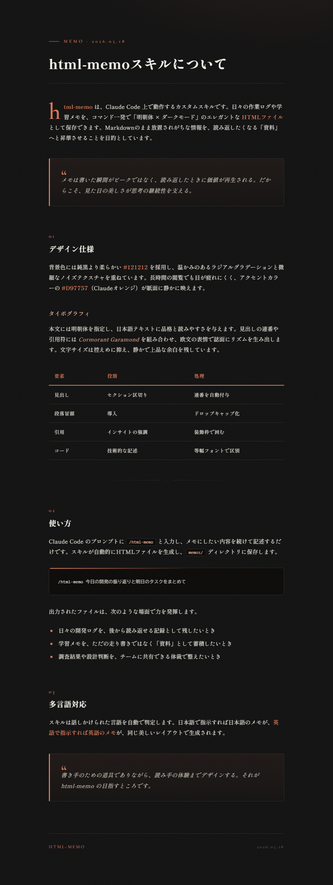

<div align="center">

# html-memo

**日々のメモや作業ログを、コマンド一発で「明朝体 × ダークモード」のエレガントなHTMLファイルへ。Claude Code のプロンプトに `/html-memo` と打つだけで、読み返したくなる「資料」が生成されます。**

> Markdownのまま放置されがちな情報を、品格のあるドキュメントへ昇華させるための Claude Code カスタムスキルです。インストール不要、`commands` フォルダに置くだけで動作します。

[](LICENSE)
[](https://claude.ai/claude-code)
[](#)

[](README.md)
[](README.en.md)

</div>

---

## 出力例

`/html-memo` で生成されるHTMLファイルは、以下のようなデザインになります。

<div align="center">
  
</div>

---

## 特徴

| | |
|---|---|
| **ダークモードベース** | 純黒より柔らかい `#121212` を採用し、長時間の閲覧でも目が疲れにくい |
| **明朝体フォント** | 日本語テキストに品格と読みやすさを与える高級感のあるタイポグラフィ |
| **オレンジのアクセント** | Claudeオレンジ `#D97757` が重要なインサイトを自然に強調 |
| **インストール不要** | `commands` フォルダに1ファイル置くだけで動作 |

---

## インストール方法

1. このリポジトリの `commands/html-memo.md` をダウンロードします。
2. あなたのプロジェクトのルートディレクトリにある `commands` フォルダ内に配置します。（フォルダがない場合は作成してください）

---

## 使い方

Claude Codeを起動し、以下のようにコマンドを実行してください。

```bash
> /html-memo 今日の開発の進捗と、今後の課題をまとめて
```

`memos/` ディレクトリに美しいHTMLファイルが自動生成されます。

---

## 快適なプレビュー環境の構築（推奨）

HTMLファイルをMarkdownのようにエディタ内で1クリックでプレビューするために、Microsoft公式の拡張機能の導入を推奨しています。

1. VS Code / Cursor で本プロジェクトを開くと、右下に `Live Preview` 拡張機能のインストール推奨ポップアップが出ますので、インストールしてください。
2. HTMLファイルを開くと、エディタの右上にプレビューアイコン（虫眼鏡マーク、または「プレビューを表示」ボタン）が表示されます。これをクリックするだけで、ブラウザを開かずにエディタ内で直接デザインを確認できます。

---

## ライセンス

[MIT License](LICENSE) のもとで公開しています。
