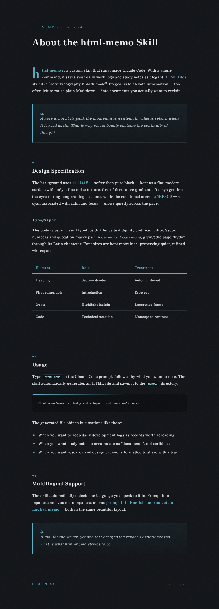

<div align="center">

# html-memo

**將每日的筆記與工作日誌，用一行指令轉換為「明朝體 × 暗色模式」的優雅 HTML 檔案。只需在 Claude Code 提示中輸入 `/html-memo`，就能生成一份讓人想反覆回顧的「文件」。**

> 這是一個 Claude Code 自訂技能，可將常被遺留為純 Markdown 的資訊昇華為精緻的文件。無需安裝，只要放入 `commands` 資料夾即可運作。

[](LICENSE)
[](https://claude.ai/claude-code)
[](#)

[](README.md)
[](README.en.md)
[](README.ko.md)
[](README.zh.md)
[](README.tw.md)

</div>

---

## 輸出範例

透過 `/html-memo` 生成的 HTML 檔案，會呈現如下設計。

<div align="center">
  
</div>

---

## 特色

| | |
|---|---|
| **以暗色模式為基礎** | 採用比純黑更柔和的 `#111418`，長時間閱讀也不易使眼睛疲勞 |
| **明朝體字體** | 為文字賦予格調與可讀性的高級排版 |
| **冷色調強調色** | 具有沉靜、聚焦效果的冷色青色 `#5BB3C9`，自然地突顯重要洞見 |
| **無需安裝** | 只要將一個檔案放入 `commands` 資料夾即可運作 |
| **多語言支援** | 自動辨識你輸入時所用的語言，並以相同語言輸出筆記 |

---

## 快速開始

無需手動放置檔案。**只要將本儲存庫的 URL 交給 Claude Code，並請它幫你設定好該技能**，即可完成設定。

啟動 Claude Code，並如下指示它。

```text
讓我可以使用這個儲存庫中的技能：
https://github.com/y177649/html-memo
```

Claude Code 會讀取儲存庫內容，並將 `commands/html-memo.md` 放入你專案的 `commands` 資料夾。完成後即可直接使用 `/html-memo` 指令。

---

## 手動安裝

如果你不使用 Claude Code，想自行設定，可依以下步驟放置。

1. 從本儲存庫下載 `commands/html-memo.md`。
2. 將其放入你專案根目錄下的 `commands` 資料夾中。（若資料夾不存在，請自行建立。）

---

## 使用方法

啟動 Claude Code，並如下執行指令。

```bash
> /html-memo 總結今天的開發進展以及今後的課題
```

`memos/` 目錄中會自動生成精美的 HTML 檔案。

---

## 打造舒適的預覽環境（建議）

為了像 Markdown 一樣在編輯器內一鍵預覽 HTML 檔案，建議安裝 Microsoft 官方擴充功能。

1. 在 VS Code / Cursor 中開啟本專案時，右下角會跳出建議安裝 `Live Preview` 擴充功能的提示，請進行安裝。
2. 開啟 HTML 檔案後，編輯器右上角會顯示預覽圖示（放大鏡標誌，或「顯示預覽」按鈕）。只要點擊它，無需開啟瀏覽器，即可在編輯器內直接確認設計。

---

## 授權條款

以 [MIT License](LICENSE) 授權公開發布。
